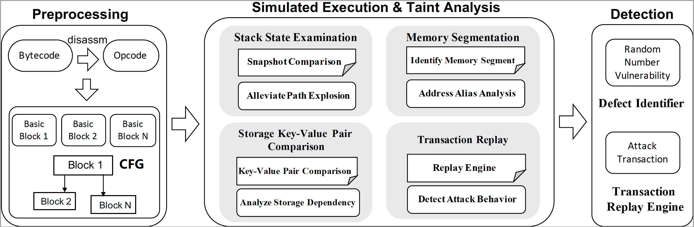

# RNVulDet

This repo is a python implementation of our *RNVulDet* – a tool that incorporates taint analysis techniques to automatically unearth random number vulnerabilities and detect attack transactions.


## Overview
<div align=center></div>
*RNVulDet* comprises preprocessing and simulated execution. This Figure depicts the overall architecture of our proposed *RNVulDet*. In particular, RNVulDet engages in four main components to perform taint analysis, i.e., stack state examination, memory segmentation, storage key-value pair comparison, and transaction replay.

## Usage
```
python3.10 main.py BYTECODE_FILE [-o OUTPUT_FILE]
```

## Dataset
Dataset\_1 contains 34 smart contracts reported to possess the random number bug.

Dataset\_2 includes a total of 214 smart contracts that do not have random number vulnerabilities.

Dataset\_3 consists of 4,617 potential victim contracts, 43,051 potential malicious contracts, and 49,951 suspicious transactions for experiments.
